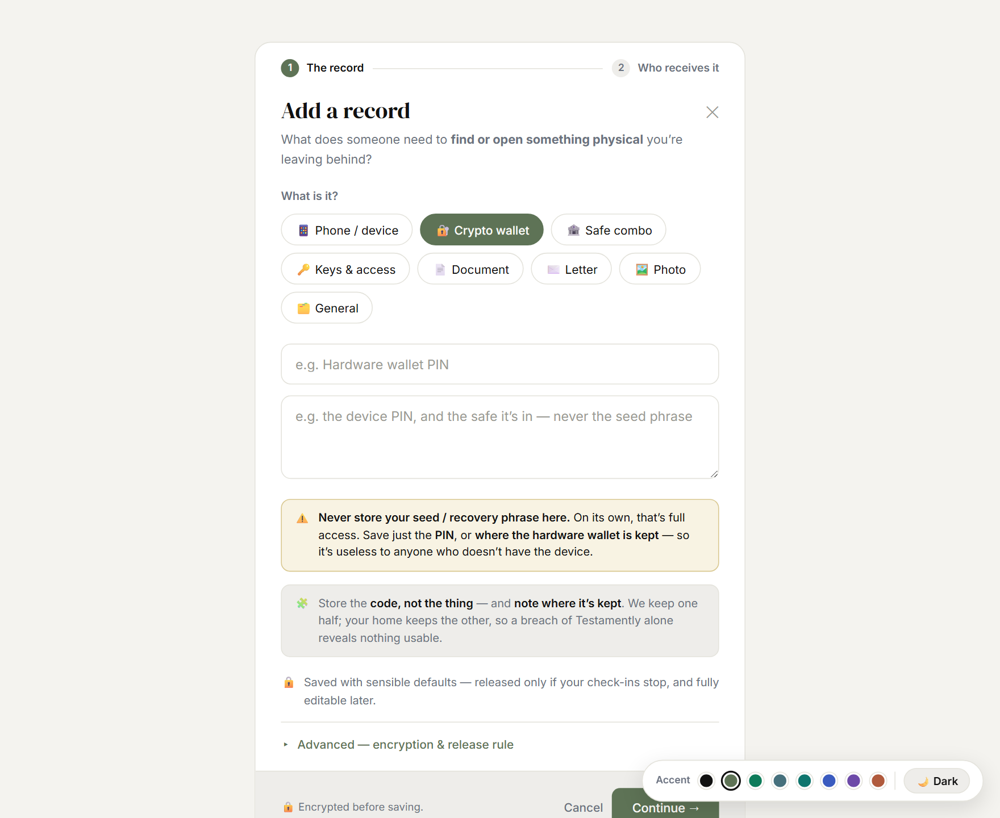
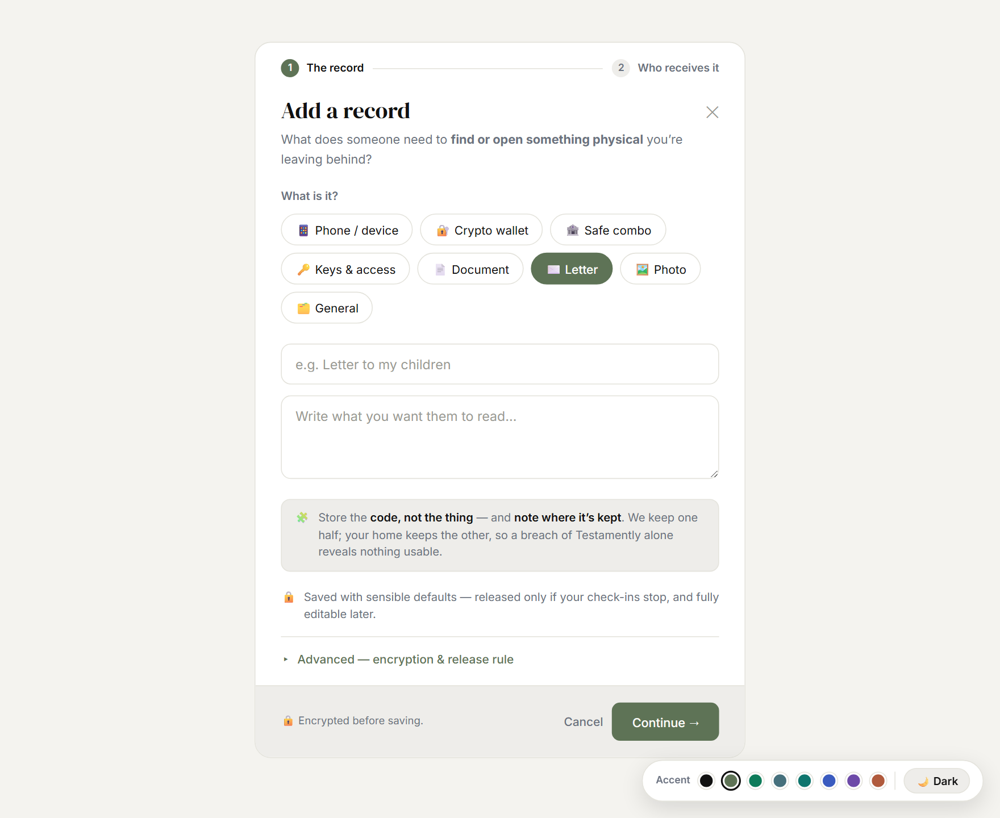
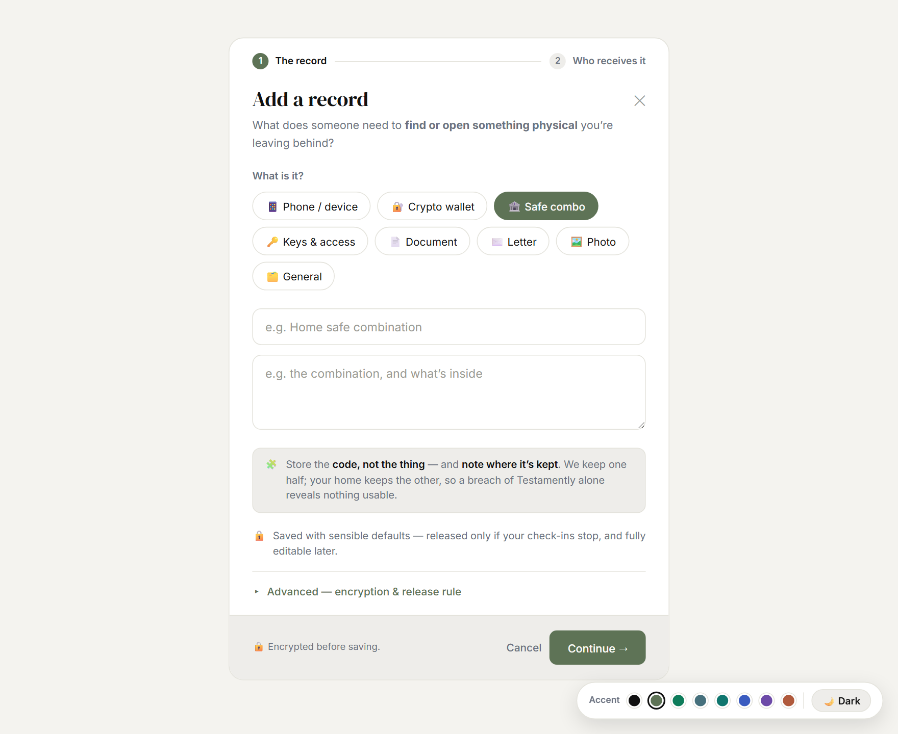

# Testamently — Product spec (new direction)

Implementable spec for the **"you hold half"** direction — record model, categories, fields and
rules. This is for **code**, not just mockups. See also: [DESIGN-PROCESS.md](./DESIGN-PROCESS.md)
(why), [MIGRATION-CHECKLIST.md](./MIGRATION-CHECKLIST.md) (rollout), [DEMO-ACCOUNT.md](./DEMO-ACCOUNT.md)
(seed data), [BLOG-IDEAS.md](./BLOG-IDEAS.md) (content).

---

## 1. What a record is

A record stores **a harmless half** — information that's useless without a physical thing the
person keeps, OR a pointer/message. **Never** a live login that is full access on its own.

### Record fields
| Field | Type | Req | Notes |
|---|---|---|---|
| `name` | text | ✓ | e.g. "Home safe combination" |
| `category` | enum | ✓ | see §2 |
| `value` | text (encrypted) | ✓ | the secret itself — **free text**, and **where the physical item is kept** goes here too (see below). |
| `hint` | text | — | A reminder the trustee sees **before** revealing — never the secret. |
| `folder` | fk | — | Optional grouping. |
| `encryption_tier` | enum | ✓ | `standard` (default) · `premium` · `gold` · `zero_knowledge`. Per-record override of the account default. |
| `release_rule` | enum | ✓ | `inactivity` (default) · `on_date` · `death_verified` |
| `release_date` | date | — | when `release_rule = on_date` |
| `trustees` | m:n | — | assignments; each has status `pending` \| `accepted` (see §4) |

### Physical location — keep it in free text, prompt with a reminder
We considered a dedicated `physical_location` field but **recommend against it**: locations are
free-form ("behind the painting", "with my sister", "top drawer of the study"), a separate field
adds friction in the simple add, and the value is already free text. Instead:
- The **value** captures the code **and** where the item is kept.
- A **reminder** nudges the user to include it — *"Store the code, not the thing — and note where
  it's kept."* — plus per-category placeholders (crypto → "…and the safe it's in").
- (A structured optional field can be added later if data ever needs it — not for v1.)

## 2. Categories (the "What is it?" picker)

Eight types, grouped by the **three record threads** so the UI presents *all three* as worthwhile —
the sentimental ones get equal weight, not just the security ones.

| Thread | Categories | Purpose |
|---|---|---|
| 🔐 **Access** (split-knowledge) | `phone_device` · `crypto_wallet` · `safe_combo` · `keys_access` | A code/combo useless without the physical item. Important, but **supporting** — not the flagship. |
| 🧭 **They'd never find it** | `document` (where the will is) · `account_policy` (life insurance, foreign account, pension) | **The flagship** — knowledge that would otherwise vanish. Universal; uniquely Testamently. |
| 🤍 **Irreplaceable** (sentimental) | `letter` · `photo` (where they're kept) | Not monetary — things you want passed on. **Equal billing**, not an afterthought. |
| 🗂️ **General** | `general` | **Free-text catch-all** — anything else important. |

**9 chips** shown in the picker (default selected = **Document / "Where my will is"** — a strong,
universal example, *not* phone). Per-category placeholder copy lives in the `PH` map
(`v4/screens/add-record-desktop.html`). An **examples banner** sits above the picker
("People add: where the will is · a life-insurance policy · …") to show breadth.

The type is interactive and drives placeholders + any safety note (e.g. the crypto warning):

  

## 3. Rules & behaviours

- **🔐 Crypto wallet alert (required).** When `category = crypto_wallet`, show:
  > ⚠️ *Never store your seed / recovery phrase here. On its own, that's full access. Save just the
  > PIN, or where the hardware wallet is kept — so it's useless to anyone who doesn't have the device.*
  Consider the same pattern for any future type where the stored value could be full access.
- **Encryption is de-emphasised** (table-stakes). Default `standard`, controls behind *Advanced* /
  *Edit* — never the headline, never bold in the create flow or marketing.
- **Add is simple (2-step):** Step 1 = category + name + value (Advanced: encryption + release +
  `physical_location`). Step 2 = assign trustees. **Edit** holds everything inline.
- **General/free-text** always available so nothing is "unsupported."

## 4. Trustees (assignment vs confirmation)

- **Assign** = link a trustee to a record. **Accepted** = they've confirmed the invite.
- Assigning an existing **accepted** trustee → active immediately.
- Inviting a new person → record is **"pending"** until they accept; they **confirm once**, then can
  be assigned to any record without re-inviting.
- Nothing is ever visible to a trustee until the vault is **released** (the dead-man's switch).

## 5. Out of scope / removed
- ❌ Generic "Password" type (implied live logins).
- ❌ `expiry` and `view_limit` / one-time-view (fight reliable delivery).
- ❌ Leading with encryption / "military-grade" copy.
